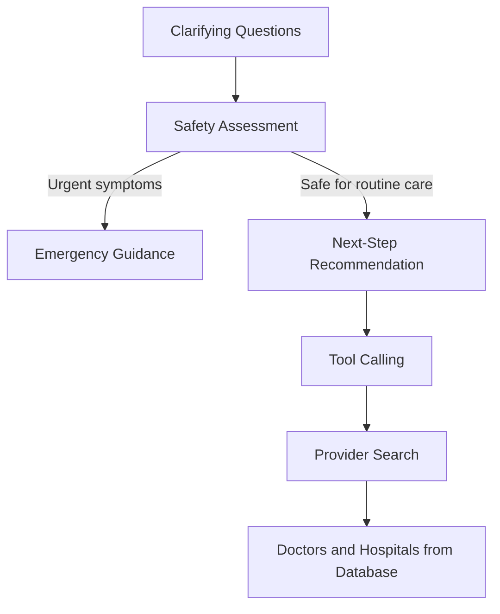

# HealTrip Technical Architecture

## Request lifecycle

1. User submits a message.
2. Client sends `POST /api/chat` with the recent conversation history.
3. Zod validates the message and bounded history.
4. The workflow asks for missing symptom or provider details.
5. The safety gate checks urgent symptoms before routine care suggestions.
6. The assistant gives a next-step recommendation when needed.
7. Provider searches run only after clarification and safety checks pass.
8. Search tools query PostgreSQL and fall back to the shared demo catalog if needed.
9. The assistant returns matching database records as patient options.
10. The client renders the response, workflow stage and options in the user's language.



Provider records in this prototype are fictional demo data. A database match does not verify a clinician, facility, appointment, or real-world availability.

## Trust boundaries

```text
Browser
  │
  │ untrusted input
  ▼
API validation
  │
  ▼
Clarification and safety workflow
  │
  │ approved provider search
  ▼
Server-side tools
  │
  ▼
Database
  │
  │ matched demo records
  ▼
Agent response
```

The browser never receives database credentials and never executes database queries.

## Future service decomposition

```text
Next.js Web
   │
   ├── API Gateway
   │
   └── Agent Orchestrator
         ├── Safety Engine
         ├── Provider Search Tool
         ├── Hospital Search Tool
         └── Audit Service

Provider Service ─── PostgreSQL
```
